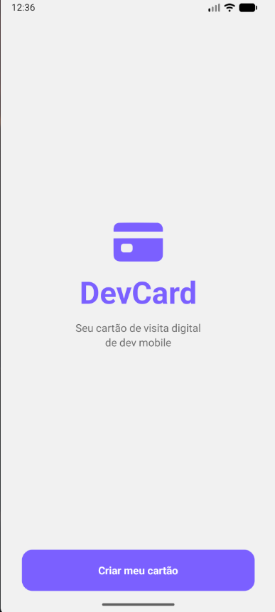
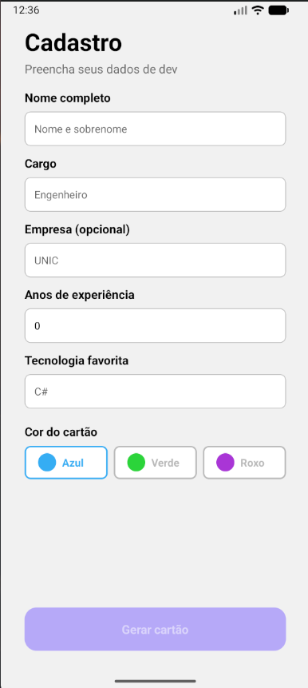
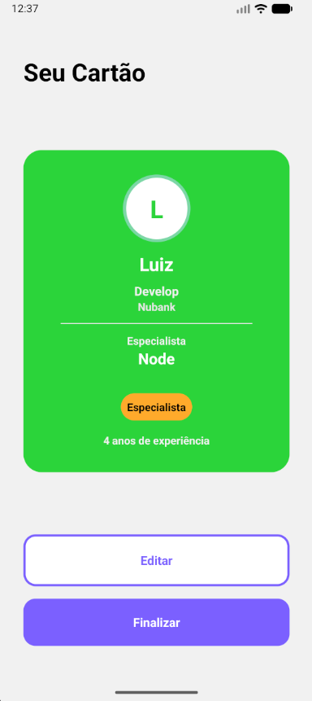
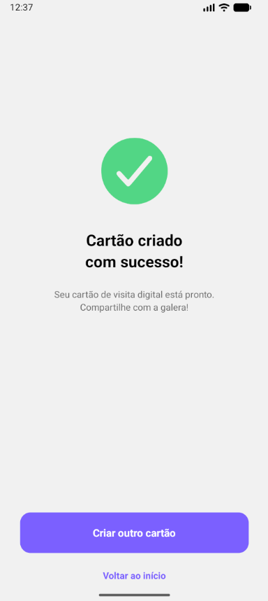

# Ia Aplicações Móveis

App para criar cards

## 📱 Telas do Projeto

Aqui estão as quatro principais telas do sistema:

### 1. Tela inicial
### Apresenta logo e subtitulo

### 2. Formulário
### Onde é feita a alimentação dos dados que irão ser exibidos no card

### 3. Tela de pré-visualização
### Onde é possível visualizar seu card e editar o mesmo caso queira

### 4. Tela de sucesso
### Informa o sucesso da criação de seu card, permitindo voltar ao inicio e criar outro

